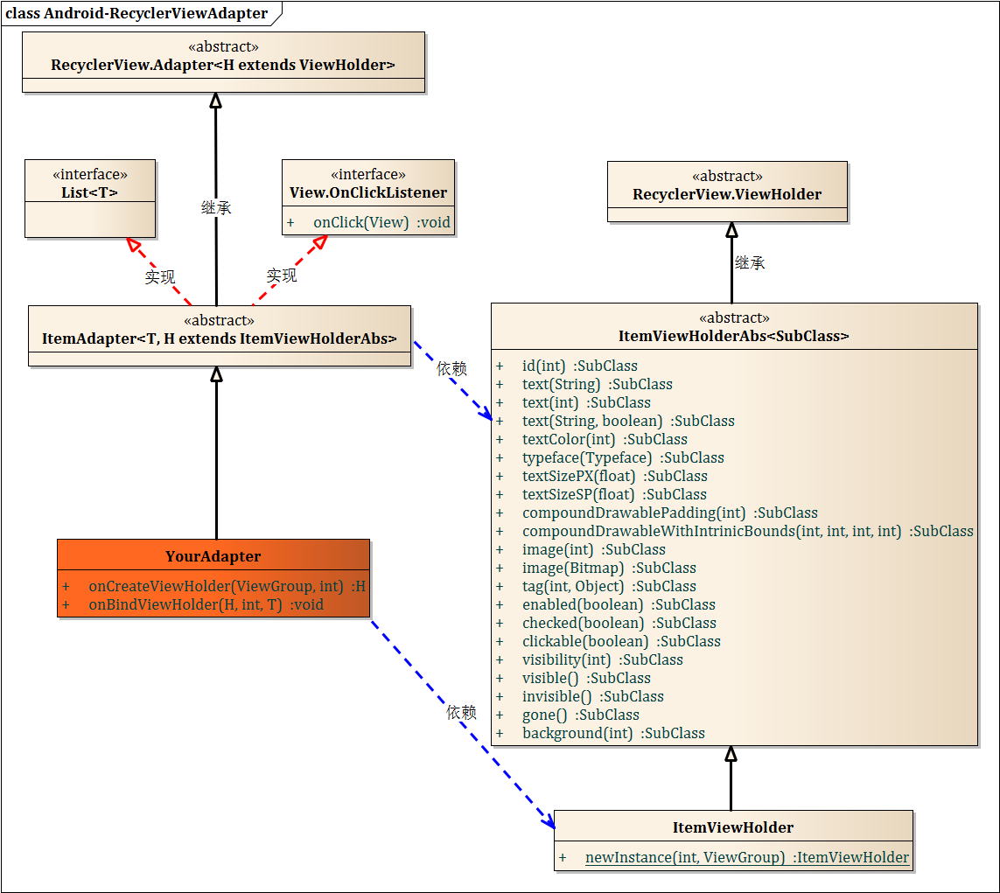

# Android-RecyclerViewAdapter
万能的RecyclerViewAdapter，可以极大的简化开发

## 1、类图


## 2、ItemViewHolderAbs
这是一个万能的ViewHolder，为了便于让您扩展，提供了此类。您想对它扩展，继承它即可。
<br>
该类的所有方法都支持链式调用。

## 3、ItemViewHolder
这是我提供的ItemViewHolderAbs的具体实现。我们平时只使用它就可以实现绝大多数功能了。如果您需要扩展功能，欢迎发起pull request。

## 4、ItemAdapter
该类实现了List接口，所以可以很方便的操作集合数据。

## 5、使用示例
实现自己的Adapter，继承自ItemAdapter，范型的第一个参数是数据项类型，第二个参数是ViewHolder，这个方便使用者实现自己的ViewHolder，并使用自定义个ViewHolder。
```
public class MyAdapter extends ItemAdapter<XXEntity, ItemViewHolder> {

    public MyAdapter(List<XXEntity> items) {
        super(items);
    }

    @Override
    public ItemViewHolder onCreateViewHolder(ViewGroup parent, int viewType) {
        return ItemViewHolder.newInstance(R.layout.item_xx, parent);
    }

    @Override
    public void onBindViewHolder(ItemViewHolder holder, int position, XXEntity item) {
        holder.id(R.id.xx).text(item.getNickName())
            .compoundDrawablesWithIntrinsicBounds(R.drawable.xx, 0, 0, 0)
            .backgroundColor(Color.TRANSPARENT)
            .visibility(item.xx ? View.GONE : View.VISIBLE)
            .id(R.id.yy).checked(isChecked)
        
        ImageView imageView = holder.id(R.id.zz).tag(R.id.zz, position).getImageView();
        Glide.with(imageView.getContext())
                .load(item.url)
                .diskCacheStrategy(DiskCacheStrategy.ALL)
                .placeholder(R.mipmap.head_default)
                .error(R.drawable.default)
                .into(imageView);
    }
}
```
## 6、混淆
不能混淆com.fpliu.newton.ui.recyclerview.ItemViewHolder，混淆脚本配置如下：
```
-keep class com.fpliu.newton.ui.recyclerview.ItemViewHolder{
    *;
}
```
